# minoJiro proxy

Conversation as minoJiro based on the knowledge prepared in advance

## Usage

```bash
# Vectorize the prepared information and store it in ChromaDB
python ./prepare.py

# Talk
python ./main.py
```

```
Let's talk to minoJiro! 🤖
? you: hello!
🤖: Hello! How can I help you today?
? you: Where are you from?
🤖: I'm from Nagoya City, Japan! Nice place.
? you: Would you be willing to work full-time for our company?
🤖: Sorry, but I currently work freelance and am not considering full-time positions. But I appreciate the offer!
? you: see you!
```

## Diagram

Retrieve the necessary information from ChromaDB, which contains relevant information, and ask ChatGPT the question with that information.

```mermaid
sequenceDiagram
  participant 😐 User
  participant 💻 App
  participant 📔 ChromaDB
  participant 🤖 ChatGPT
  😐 User->>💻 App: Question text
  💻 App->>🤖 ChatGPT: Question text
  🤖 ChatGPT-->>💻 App: Question vector (embedded)
  💻 App->>📔 ChromaDB: Question vector
  📔 ChromaDB-->>💻 App: Text related to the question
  💻 App->>🤖 ChatGPT: Text related to the question + Question text
  🤖 ChatGPT-->>😐 User: Answer
```

